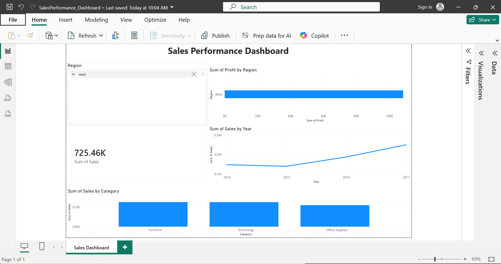

# PowerBI-Sales-Dashboard
## Overview

This Power BI dashboard analyzes sales performance using the Sample Superstore dataset.

## Dashboard Features

- Total Sales KPI
- Sales by Category
- Profit by Region
- Sales Trend by Year
- Region Filter (Slicer)

## Tools Used

- Power BI Desktop
- Sample Superstore Dataset

## Dataset

Sample Superstore Dataset (CSV)

## Dashboard Preview

## Files Included

- Sales_Performance_Dashboard.pbix
- Sample-Superstore.csv
- dashboard.png

## Skills Demonstrated

- Data Visualization
- Dashboard Design
- KPI Cards
- Slicers
- Bar Charts
- Line Charts
- Power BI
